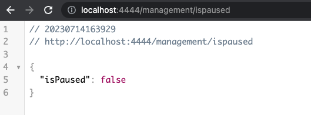

# Projeto de Blockchain usando Node.js e Express

Este é um projeto de exemplo que demonstra como integrar contratos inteligentes (smart contracts) na blockchain usando Node.js, Express, TypeChain e Ethers.

## Configuração

1. Clone este repositório para o seu ambiente local.

2. Instale as dependências do projeto executando o seguinte comando no diretório raiz do projeto:

```shell
npm install
```

3. Certifique-se de ter uma conexão válida com a blockchain Ethereum. Você pode usar uma rede de desenvolvimento local como o Ganache ou se conectar a uma rede de teste como o Sepolia.

4. Configure as informações da sua conexão Ethereum no arquivo `.env.development`. Você pode usar o arquivo `.env.example` como um modelo e renomeá-lo para `.env.development`. Certifique-se de preencher os campos `PROVIDER_RPC` com o URL do provedor Ethereum, `PRIVATE_KEY` com sua chave privada e `MANAGMENT_ADDRESS` com o endereço do contrato inteligente que deseja interagir.


## Rotas

O projeto contém as seguintes rotas para interagir com o contrato inteligente:

### GET management/ispaused

Retorna se o contrato esta pausado ou não.

### GET management/getFee

Retorna o Fee do contrato diretamente da blockchain SEPOLIA


### POST management/newcrowdfund

Cria um novo crowdfunding no contrato inteligente. É necessário fornecer os parâmetros necessários para criar o crowdfunding.

Corpo da solicitação (JSON):

```ts
{
  symbol: PromiseOrValue<string>,
  baseURI: PromiseOrValue<string>,
  royalty: PromiseOrValue<BigNumberish>,
  owner: PromiseOrValue<string>,
  cfParams: {
    valuesLowQuota: [
      PromiseOrValue<BigNumberish>,
      PromiseOrValue<BigNumberish>,
      PromiseOrValue<BigNumberish>
    ]; 
    valuesRegQuota: [
      PromiseOrValue<BigNumberish>,
      PromiseOrValue<BigNumberish>,
      PromiseOrValue<BigNumberish>
    ];
    valuesHighQuota: [
      PromiseOrValue<BigNumberish>,
      PromiseOrValue<BigNumberish>,
      PromiseOrValue<BigNumberish>
    ];
    amountLowQuota: PromiseOrValue<BigNumberish>;
    amountRegQuota: PromiseOrValue<BigNumberish>;
    amountHighQuota: PromiseOrValue<BigNumberish>;
    donationReceiver: PromiseOrValue<string>;
    donationFee: PromiseOrValue<BigNumberish>;
    minSoldRate: PromiseOrValue<BigNumberish>;
    crowdfundDuration: PromiseOrValue<BigNumberish>;
  },
  overrides?: Overrides & { from?: PromiseOrValue<string>
  }
}
```

## Executando o Projeto

Para executar o projeto, utilize o seguinte comando:

```shell
npm run dev
```


Isso iniciará o servidor Node.js na porta 4444. Você pode acessar o projeto no seu navegador usando o URL `http://localhost:4444`.


## PrintScreen



